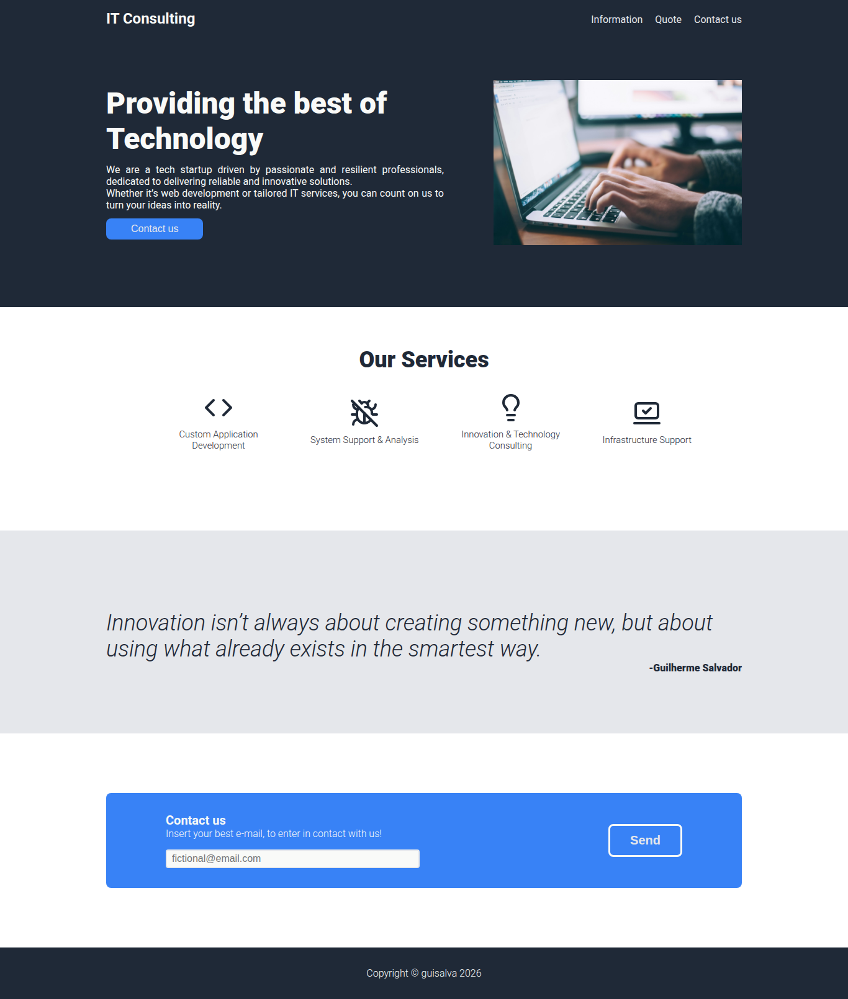

# Odin - IT Consulting Landing Page


This project was built to practice core concepts from the **Foundations Course** of [The Odin Project](https://www.theodinproject.com).

It is a static landing page for a fictional IT consulting startup, focusing on layout structure, styling, and basic UI design principles.

## 🛠️ Tech Stack

- HTML
- CSS

## 🚀 Installation and Usage

Clone the repository:

```bash
git clone https://github.com/guisalva/odin-it-consulting-landing-page.git

cd odin-it-consulting-landing-page
```

Run the project:

1. Open `index.html` in your preferred browser;
2. Or use an extension like Live Server for a better development experience;

## 📸 Preview



## 📚 Credits

- Image - [Person using MacBook Pro](https://unsplash.com/photos/person-using-macbook-pro-npxXWgQ33ZQ), Author - [@glenncarstenspeters](https://unsplash.com/@glenncarstenspeters)
